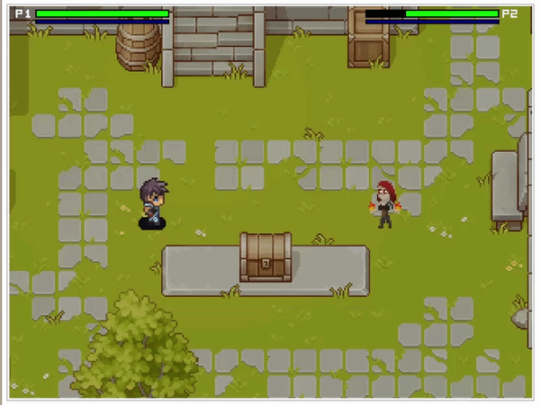
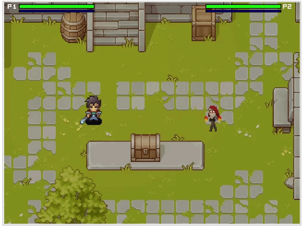

# Topdown 

Real-time 2-player fighting game on the DE1-SoC implemented in bare-metal C, with direct memory-mapped VGA rendering and no operating system or graphics libraries.

## Demo

  

  ▶️ Full dynamic camera zoom demo (real-time): 
  <a href="https://youtu.be/ivtzvIkwsYQ">Watch here</a>

---

## Overview

This project implements a real-time 2-player fighting game entirely on an FPGA using bare-metal C. The system directly interfaces with memory-mapped I/O for VGA output and input handling, without relying on any OS or graphics framework.

The game integrates real-time input processing, animation state machines, collision detection, and rendering within a single deterministic loop under tight performance constraints.

---

## Controls

### Player 1
- Movement: `W` `A` `S` `D`
- Attack / Parry: `J`
- Defense: `K`
- Ability: `N/A`

### Player 2
- Movement: Arrow Keys
- Attack: `NUMPAD 1`
- Defense (Block / Parry): `NUMPAD 2`
- Ability: `NUMPAD 3`

---

## Core System Design

### Movement and State Management
Player behavior is implemented using explicit state machines (idle, walk, attack, defense, ability). State transitions are driven by input and timing constraints to ensure deterministic behavior.

Positions are maintained in world coordinates and transformed into screen coordinates through the camera system, decoupling game logic from rendering.

### Attack and Hit Detection
Attacks are frame-accurate and active only during specific animation windows. Hit detection is synchronized with animation frames, requiring precise coordination between rendering and gameplay logic.

### Defense
Defense is implemented as a hold-based state that remains active while the input is pressed. This required continuous input handling and correct synchronization with animation, movement constraints, and damage logic.

### Parry System
Parry is implemented as a separate timing-sensitive mechanic with a short active window. Successful parries negate and reflect incoming attacks, requiring precise coordination between state transitions, frame timing, collision detection, and attack resolution, as well as tight synchronization between player state transitions, animation timing, and collision checks.

### Ability System
Abilities spawn additional entities (e.g., projectiles or spells) with independent lifecycles. These entities are updated and rendered in real-time using the same collision and rendering pipeline.

---

## Camera and Dynamic Zoom

A dynamic camera system tracks both players and controls rendering to the VGA display.

- Camera position is computed as the midpoint between players  
- Zoom level is adjusted based on inter-player distance  
- Rendering uses nearest-neighbor scaling implemented directly in software  

All scaling is performed during pixel writes to the VGA buffer without hardware acceleration, requiring careful optimization to maintain real-time performance.

---
## Example Mechanics (Visuals)

### Warrior
**Class Type:** Melee  
**Focus:** Close-range attacks, defense, and parry timing  

**Attack and Defense (Parry / Block)**

---

### Sorceress
**Class Type:** Ranged  
**Focus:** Projectile attacks, defense, and special ability usage  

**Attack, Defense, and Ability**

## Systems Engineering Highlights

- **Bare-metal graphics pipeline**  
  Direct pixel writes to a memory-mapped VGA buffer, reinforcing low-level hardware control.

- **Deterministic real-time loop**  
  Integrated input handling, state updates, and rendering within a tightly controlled execution loop.

- **State machine architecture**  
  Structured player behavior using explicit state machines for predictable and maintainable transitions.

- **Software-based rendering optimizations**  
  Implemented dynamic zoom and scaling without hardware acceleration, requiring efficient pixel operations.

- **Synchronization across subsystems**  
  Coordinated animation timing, collision detection, and gameplay logic to maintain responsiveness and correctness.

- **Modular embedded design**  
  Separated input handling, rendering, physics, and game logic into cohesive components for easier debugging and scalability.
